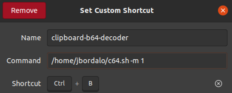

# Clipboard Base64 Decoder

## About The Project
Decodes Base64 directly from your clipboard. Decoded string available on your clipboard.

## Getting Started

Clone the project locally. 

## Prerequisites

xclip must be installed on the machine: 
To check if xclip is installed, run: 
`which xclip` 
If there is no output, run: 
`sudo apt install xclip` 
Or the equivalent for your distribution. 

## Installation

After installing `xclip`, the only needed file is c64.sh. 
It must have run permissions. To give it run permissions, run: 
`chmod +x c64.sh` 

The program has two modes, indicated by the `-m` flag:
* 0 - Use the contents of the PRIMARY CLIPBOARD (selection and mouse middle click)
* 1 - Use the contents of the CLIPBOARD (explicit copy-paste operations using keyboard)

0 is the default mode.

You can run the script manually or set a shortcut on your system, ie: 
 
Using the absolute path to the script or adding it to the `$PATH`.

## Usage

1. Select or copy a Base64 encoded string of text.
2. Press the shortcut.
3. Paste the decoded string on the desired location.

## Built With

* [xclip](https://linux.die.net/man/1/xclip)

## Authors

* **João Bordalo** - *Initial work* - [jbordalo](https://github.com/jbordalo)